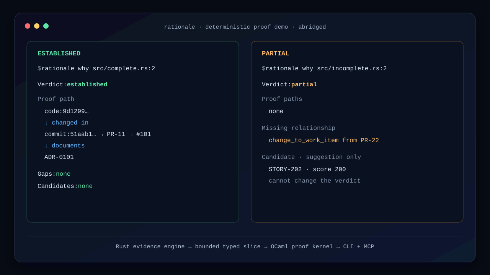

# Rationale

Rationale proves whether a line of code is connected to recorded intent—and
shows the missing link when it is not.



## Try it in 60 seconds

The release archive contains the Rust CLI, its adjacent OCaml proof worker, and
the offline demonstration. It needs Git and Python 3, but no Rust or OCaml
installation:

```sh
VERSION=v0.1.0
TARGET=aarch64-apple-darwin       # use x86_64-unknown-linux-gnu on Linux
ARCHIVE="rationale-${VERSION}-${TARGET}.tar.gz"

curl -fLO "https://github.com/Al3xWalton/rationale/releases/download/${VERSION}/${ARCHIVE}"
curl -fLO "https://github.com/Al3xWalton/rationale/releases/download/${VERSION}/${ARCHIVE}.sha256"
if command -v sha256sum >/dev/null 2>&1; then
  sha256sum -c "${ARCHIVE}.sha256"
else
  shasum -a 256 -c "${ARCHIVE}.sha256"
fi
tar -xzf "$ARCHIVE"
cd "${ARCHIVE%.tar.gz}"
./scripts/run-demo.sh
```

The demo creates a disposable repository and shows established, partial,
not-established, conflicted, and explicitly resolved results. To install after
the demo, place `rationale` and `rationale-kernel-worker` together somewhere on
your `PATH`; the CLI discovers its companion automatically.

## Status

Rationale now has a complete hybrid proof slice. The Rust CLI synchronizes local
Git history, namespaced repository documents, and explicit GitHub review
relationships into an atomic SQLite snapshot. It resolves real lines through
blame and rename-aware history, then asks the long-lived OCaml kernel for a
canonical established, partial, not-established, or conflicted result. Partial
and absent proofs include auditable non-proving candidate records. The four
read-only MCP tools are available over local stdio.

## Architecture

- **Rust** owns repository ingestion, indexing, the CLI, and MCP.
- **OCaml** owns the pure, deterministic proof kernel.
- A versioned process protocol keeps the language boundary explicit.
- Four-byte length-prefixed frames, deadlines, and bounded restart keep worker
  failure observable without inventing a fallback verdict.
- SQLite holds immutable evidence and exposes only complete current snapshots to
  proof readers, even while the next synchronization is being assembled.
- Local Git resolution distinguishes committed evidence from unattributed
  working-copy lines and marks shallow history as incomplete.
- Document ingestion recognizes configured literal identifiers and quarantines
  malformed metadata without turning nearby files into inferred relationships.
- GitHub synchronization follows API-native pull-request membership and explicit
  closing relationships; a failed refresh retains the last valid contribution
  and marks it stale.
- Rationale never calls a language model. An external agent may explain its
  structured results without changing their verdicts.

The split is deliberately small. Rust handles untrusted files, Git, SQLite,
GitHub, the CLI, and MCP; OCaml receives a bounded typed graph and owns only the
pure proof decision. Keeping the kernel behind a versioned process boundary
makes that authority visible and independently testable. At the current
AVA-like baseline, the long-lived worker boundary adds an estimated 0.061 ms.

The implementation follows one thin end-to-end proof path, with every later
source and presentation layer preserving the same deterministic proof contract.

## Local CLI

Build the worker and CLI, then synchronize a repository from anywhere inside
its working tree:

```sh
opam exec --switch=rationale-5.5.1 -- dune build --root ocaml @all
cargo build --release --bin rationale

./target/release/rationale sync
RATIONALE_KERNEL_WORKER="$PWD/ocaml/_build/default/worker/main.exe" \
  ./target/release/rationale why src/lib.rs:42
```

The local commands are:

```text
rationale sync [--local]
rationale why <path:line|path:start-end@revision|commit:revision>
rationale show <record-id>
rationale gaps --changed
```

Add `--json` to any command for structured output. Human `why` output always
orders the verdict, proof paths, gaps, non-proving candidates, and source
freshness. The CLI uses stable exit categories so scripts never need to parse
prose:

| Exit | Category | Meaning |
| ---: | --- | --- |
| 0 | success | The command succeeded or rationale was established. |
| 1 | operational | Local storage, filesystem, or resource-bound failure. |
| 2 | missing rationale | A record or admissible proof path is missing. |
| 3 | conflict | Current explicit evidence conflicts. |
| 4 | invalid input | The target, path, revision, or kernel request is invalid. |
| 5 | stale source | The result used incomplete or stale source history. |
| 6 | proof unavailable | The authoritative OCaml worker could not return a proof. |

Rationale stores local state under `.rationale/` by default. It ignores that
directory when reporting changed working-copy gaps.

### Public offline demo

Run the complete synthetic demonstration with one command:

```sh
make demo
```

The command creates a new repository with fixed authorship and timestamps,
replays recorded GitHub API responses on loopback, and prints all four kernel
verdicts. It then advances from two conflicting decisions to a follow-up commit
that explicitly supersedes the old outcome. The incomplete case ranks a nearby
Story while showing that the suggestion cannot enter the proof.

The generated repository is retained at the printed temporary path for
inspection. It contains no AVA code or data. Pass a new directory to
`scripts/run-demo.sh` if you want a predictable location.

### GitHub synchronization

`rationale sync` reads the repository's `origin` remote and combines local
evidence with GitHub issues, pull requests, pull-request commits, and explicit
closing links. Public repositories need no credential. For private repositories,
set `GH_TOKEN` or `GITHUB_TOKEN` to a read-only token for the command; Rationale
uses it only in the request header and never writes it to the database, cursor,
or error output.

Pagination and request volume are bounded. Conditional requests reuse the last
published cursor, and rate-limit metadata appears in JSON sync reports. If a
refresh fails, Rationale publishes current local evidence alongside the last
valid GitHub contribution with `github:<owner>/<repository>` marked stale. Use
`rationale sync --local` when network access is unavailable or unwanted.

### Candidate evidence

Candidate records are ranked only after the OCaml kernel returns a partial or
not-established verdict. Scoring version 1 assigns 1,000 points for an exact
identifier, 100 per exact normalized token (up to eight), 20 per exact path
segment (up to four), and a zero-to-four bounded recency bucket. Equal scores
sort by stable record ID. The JSON response includes every component needed to
reconstruct the total.

Candidate scores and candidate designations are suggestions, not evidence
relationships: neither enters a kernel request or proof path, and selecting or
omitting a suggestion cannot promote a verdict.

## Measured performance

The reproducible `ava-like` fixture contains 400 commits, 1,000 files, and 50
evidence documents. On an Apple M4 Max with Rust 1.98.0 and OCaml 5.5.1, the
September 2026 release-mode baseline measured:

| Operation | p95 |
| --- | ---: |
| Incremental offline synchronization | 34.842 ms |
| Graph-slice extraction | 2.256 ms |
| Long-lived worker round trip | 0.080 ms |
| Warm engine query | 5.890 ms |
| Warm CLI query | 15.219 ms |
| Warm MCP query | 6.061 ms |
| SQLite snapshot publication | 10.504 ms |

The bounded query sent 4 nodes and 3 edges to the OCaml kernel from a stored
snapshot of 480 nodes and 479 edges. Two hundred repeated queries added 2.4 MiB
of resident process-tree memory, and the engine, CLI, MCP, and worker payloads
remained byte-identical. These are single-machine measurements, not universal
claims; the generated fixture, budgets, and host metadata are recorded in the
[benchmark methodology](benchmarks/README.md) and
[machine-readable result](benchmarks/results/latest.json).

## Agent integration

`rationale serve` exposes four read-only MCP tools over stdio:

- `explain_rationale(target)` returns the canonical proof, gaps, candidates,
  and freshness;
- `get_evidence(record_id)` returns a normalized record with its citation;
- `find_rationale_gaps(scope)` reports conservative changed-path gaps;
- `search_candidate_evidence(query)` ranks suggestions without creating proof
  relationships.

The server performs no model sampling and exposes no mutation tools. A local
MCP client can launch it with configuration shaped like this:

```json
{
  "mcpServers": {
    "rationale": {
      "command": "/absolute/path/to/rationale",
      "args": [
        "--database",
        ".rationale/rationale.db",
        "--worker",
        "/absolute/path/to/rationale-kernel-worker",
        "serve"
      ],
      "cwd": "/absolute/path/to/your/repository"
    }
  }
}
```

Run `rationale sync` in that repository before the agent queries it, or
`rationale sync --local` for an offline-only snapshot. MCP success payloads use
the same structured result objects as CLI `--json`.

## Limitations and non-goals

- Version one proves only explicit supported relationships. It does not infer an
  author's intent, recover hidden reasoning, or treat co-change and textual
  similarity as evidence.
- Direct query targets are committed line ranges and commits. Symbols, pull
  requests, and work-item identifiers can appear in evidence but are not direct
  version-one target syntax.
- Repository documents must use Rationale's namespaced metadata. Malformed or
  oversized records are quarantined rather than guessed at.
- GitHub synchronization supports GitHub repositories and explicit API-native
  pull-request membership and closing relationships. Queries use the last local
  snapshot; they do not make live network calls.
- Candidate ranking is bounded exact-token and path matching. It is a repair aid,
  not semantic search and never proof.
- MCP is local stdio and read-only. Rationale does not edit records, call a model,
  or generate explanatory prose.
- Prebuilt version-one packages cover Apple-silicon macOS and x86-64 Linux. Other
  targets currently require an unsupported source build.

## Related work

[LocalityBench](https://github.com/Al3xWalton/locality-bench) is an independent,
in-progress benchmark about choosing local, remote, or hybrid execution for
personalized agent tasks. Its current diagnostic is not claim-eligible;
Rationale borrows no placement result from it.

[SWE-Story](https://github.com/Al3xWalton/swe-story) is an independent proposed
benchmark for the correctness and human reviewability of agent-authored Git
histories. It currently supports no empirical claim. Rationale instead treats
observable repository records as evidence and never presents commits as a
transcript of a model's hidden reasoning.

Together they occupy different portfolio roles: LocalityBench studies where an
agent should run, SWE-Story asks how agent work should be evaluated, and
Rationale is the developer tool that checks whether implementation remains tied
to recorded intent.

## Development

Rust 1.98.0 is pinned through `rust-toolchain.toml`. OCaml uses a named opam
switch pinned to OCaml 5.5.1. The named switch keeps opam build prefixes free of
spaces even when the repository lives under a workspace path containing spaces.

```sh
opam switch create rationale-5.5.1 ocaml-base-compiler.5.5.1
opam install --switch=rationale-5.5.1 ./ocaml \
  --deps-only --with-test --with-dev-setup --yes
make verify
```

During development, `make verify` builds the OCaml companion worker before the
Rust cross-language tests. Installed builds discover `rationale-kernel-worker`
beside the Rust executable. Set `RATIONALE_KERNEL_WORKER` to an explicit path
when testing or packaging a different worker build.

`make audit` checks advisories, licenses, dependency duplication, and dependency
sources under the repository policy. `make fuzz-check` compiles the bounded
protocol-frame, Git-target, and document-metadata fuzz harnesses. Run campaigns
with a nightly Rust toolchain and `cargo fuzz run <target>` from `fuzz/`.

`make release-smoke` builds a host archive and tests the extracted CLI, offline
demo, manifest, checksums, companion-worker discovery, and MCP connection. See
[docs/RELEASING.md](docs/RELEASING.md) for clean-runner packaging and tag gates.

See [CONTRIBUTING.md](CONTRIBUTING.md) for the Story and commit conventions.

## License

Licensed under the [Apache License 2.0](LICENSE). Redistributions retain the
project attribution recorded in [NOTICE](NOTICE).
